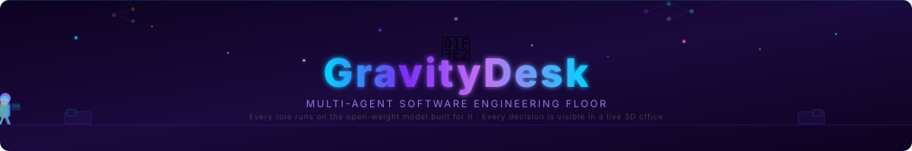
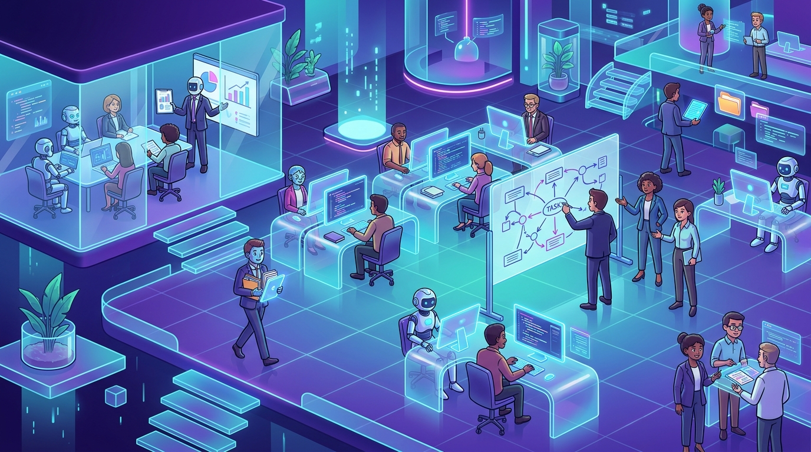
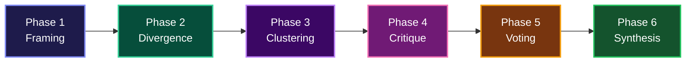
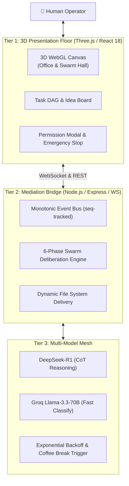
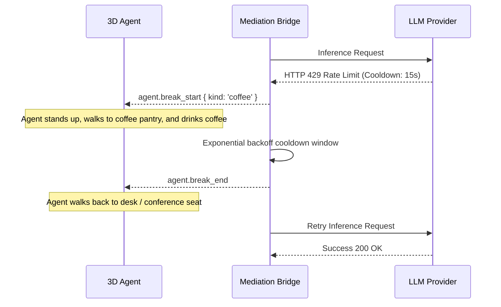

<!-- Animated Header with Walking AI Agents -->
<p align="center">
  
</p>

<!-- Hero Banner -->
<p align="center">
  
</p>

<!-- Badges -->
<p align="center">
  <a href="#"></a>
  <a href="#"></a>
  <a href="#"></a>
  <a href="#"></a>
  <a href="#"></a>
</p>

<p align="center">
  <a href="#"></a>
  <a href="#"></a>
  <a href="#"></a>
  <a href="#"></a>
</p>

---

### The world's first spatially-grounded, multi-agent autonomous engineering simulation where specialized AI agents plan, debate in swarms, cross-examine architectures, and deliver production-ready code inside an observable real-time 3D workspace.

---

## ⚡ Core Highlights

- **Dual-Engine Workflows:** Switch seamlessly between **Deskmates Virtual Office** (4 core specialized engineers) and **Swarm Hall** (10, 20, or 50 specialized agents at the grand conference table).
- **100% Dynamic & Zero-Hardcoding:** Every proposal, critique, and code deliverable is synthesized live from your prompt using **DeepSeek-R1** and **Groq Llama-3.3-70B**.
- **Visual Rate-Limit Backoff (Coffee Breaks):** On HTTP 429 rate limits, agents physically walk to the coffee station, drink coffee during the backoff window, and return to their seats once the cooldown expires.
- **Human-in-the-Loop Safety:** Granular permission modals for file writes, shell commands, and git commits, backed by an instant **Emergency Stop** killswitch.
- **Deep Reasoning Preservation:** Dedicated 65s timeout window to preserve full Chain-of-Thought (CoT) traces from DeepSeek-R1.

---

## 🏛️ Dual Working Modalities

### 1. Deskmates Office Mode (Collaborative Sprint Execution)
Designed for iterative feature development, bug fixing, and test-driven refactoring:
- 👩‍💼 **Diya (Lead Manager):** Goal deconstruction, DAG triage, and real-time operator chat.
- 👨‍💻 **Rohan (Backend Engineer):** High-throughput APIs, schemas, and system logic.
- 🎨 **Kabir (Frontend Engineer):** Component architecture, UI/UX, and styling.
- 🧪 **Nisha (QA & Test Architect):** Edge cases, unit testing, and acceptance verification.

### 2. Swarm Hall Mode (Massive Consensus Synthesis)
Designed for high-stakes architectural synthesis and system design:
- **Amphitheater Seating:** 10, 20, or 50 specialized agents seated inward around the central oval conference table.
- **Specialized Roles:** Security Auditors, Distributed Systems Architects, Latency Profilers, and Protocol Engineers.
- **Production Code Output:** Multi-file codebases generated directly into `output/<ProjectSlug>_Swarm/`.

---

## 🔄 The 6-Phase Swarm Consensus Protocol



1. **Framing:** Moderator Diya deconstructs user prompt into orthogonal architectural vectors.
2. **Divergence:** All agents draft independent proposals in isolation (eliminating early bias).
3. **Clustering:** Proposals are semantically clustered on the 3D Idea Board, reducing communication complexity from $O(N^2)$ to $O(N \cdot K)$.
4. **Adversarial Critique:** Agents cross-examine ideas with mandatory `SUPPORT` vs. `CHALLENGE` stances.
5. **Weighted Voting:** Quadratic / Borda voting determines quorum consensus (>70%).
6. **Synthesis:** Complete multi-file source code is generated and written directly to the host filesystem.

---

## 🏗️ System Architecture



---

## ☕ Visual Rate-Limit Backoff (Coffee Breaks)



---

## 🚀 Quick Start Guide

### 1. Prerequisites
- **Node.js** 20+ & **npm** 10+
- An API key for OpenRouter or Groq

### 2. Setup
```bash
git clone https://github.com/atharv1909/BenchMates.git
cd BenchMates

# Setup environment variables
cp .env.example .env
# Add your key to .env:
# OPENROUTER_API_KEY=sk-or-v1-...

# Install dependencies
cd frontend
npm install
cd ..
```

### 3. Run GravityDesk
**Terminal 1 (Mediation Bridge):**
```bash
cd frontend
npm run bridge:mock
```

**Terminal 2 (3D Virtual Floor):**
```bash
cd frontend
npm run dev
```

Open `http://localhost:5173` in your browser, pick your mode, and start innovating!

---

## 🧪 Automated Test Suite

Run the full kinematics, navigation, and contract test suite:
```bash
cd frontend
npm test
```
```
 ✓ src/tests/swarmLayout.test.ts (10 tests)
 ✓ src/tests/nav.test.ts (3 tests)
 ✓ src/tests/triage.test.ts (10 tests)
 ✓ src/tests/swarmTape.test.ts (3 tests)
 ✓ src/tests/layout.test.ts (3 tests)
 ✓ src/tests/integration.test.ts (4 tests)
 ✓ src/tests/stress.test.ts (1 test)
 ✓ src/tests/swarmEntrance.test.ts (2 tests)

 Test Files  8 passed (8)
      Tests  36 passed (36)
```

---

<p align="center">
  <b>GravityDesk</b> · Built with 💜 for the next generation of autonomous engineering.
</p>
